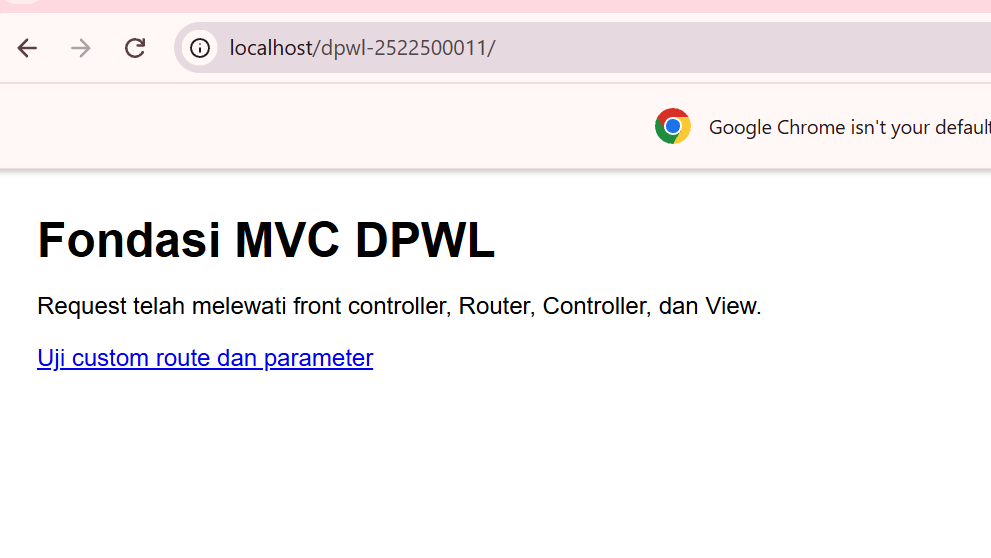
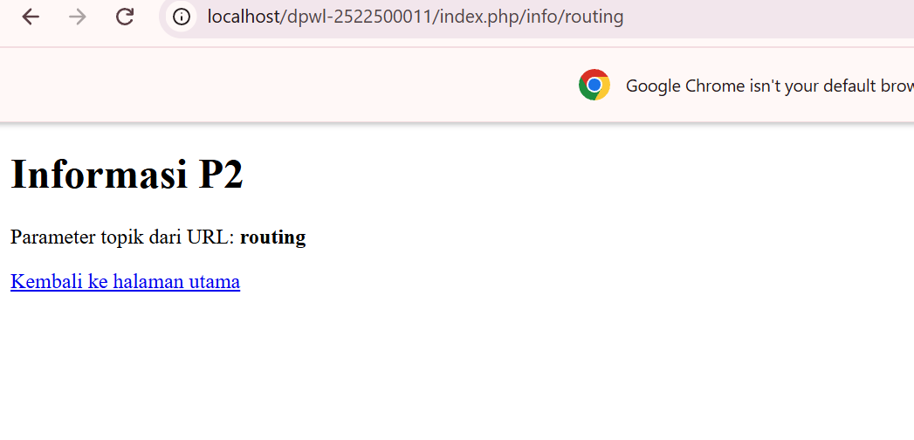
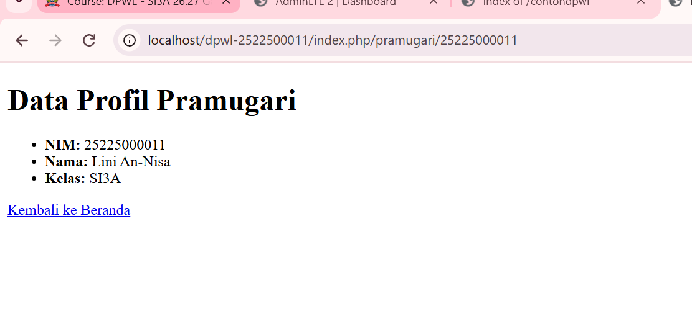

# pertemuan-02
## 1. Tujuan Praktikum
[Jelaskan tujuan P2 dengan kalimat sendiri.]
## Jawaban No 1: 
Pada P2 ini, tujuannya adalah supaya kami tidak hanya sekadar bisa menampilkan halaman web, tapi benar-benar paham "dapur" di balik arsitektur MVC. Kami diajarkan cara membuat kerangka MVC buatan sendiri dari awal.   Fokus utamanya mencakup beberapa hal:
1. Mengubah pola akses web: Dari yang tadinya buka file PHP secara langsung, sekarang menggunakan satu pintu utama yaitu Front Controller (index.php).   
2. Memahami Routing: Belajar bagaimana alur URL yang diketik pengguna di-redirect oleh Router menuju Controller dan action/method yang tepat.   
3. Mengelola Aset & Navigasi: Memanfaatkan fitur Base URL dan Helper (base_url() dan site_url()) supaya pemanggilan aset CSS/JS dan link navigasi aplikasi jadi dinamis dan konsisten.    4. Memahami Alur Request-Response: Mampu menelusuri proses masuknya request dari browser, melewati Front Controller, Router, diproses oleh Controller, hingga akhirnya menampilkan hasil visual berupa View.

## 2. Struktur Direktori
## jawaban 2. Struktur Direktori
```text
pertemuan-02/
├── application/
│   ├── config/
│   │   ├── config.php      -> Mengatur konfigurasi dasar aplikasi (Base URL, dll)
│   │   └── routes.php      -> Mengatur pemetaan rute URL ke Controller
│   ├── controllers/
│   │   └── Home.php        -> Controller utama untuk menangani logika request
│   ├── helpers/
│   │   └── url_helper.php  -> Menyediakan fungsi bantuan base_url() dan site_url()
│   └── views/
│       └── home/
│           ├── index.php   -> View untuk halaman utama (beranda)
│           ├── info.php    -> View untuk menampilkan informasi routing
│           └── pramugari.php -> View kustom untuk profil pramugari
├── assets/
│   └── css/
│       └── app.css         -> File stylesheet aset statis
├── system/                  -> Core framework MVC
└── index.php               -> Front Controller (pintu masuk utama aplikasi)
```
## 3. Front controller
[Jelaskan peran index.php sebagai satu titik masuk aplikasi.]
## jawaban:
Dalam arsitektur web modern—khususnya yang menerapkan pola MVC (Model-View-Controller)—file index.php berperan sebagai Front Controller atau satu-satunya pintu masuk utama (single point of entry) bagi seluruh permintaan (request) pengguna.

Peran Utama index.php
1. Sebagai Satpam / Gerbang Utama (Single Entry Point)

Pengguna tidak lagi memanggil file PHP secara langsung (misalnya [lokasi.com/profil.php](https://lokasi.com/profil.php) atau [lokasi.com/kontak.php](https://lokasi.com/kontak.php)).

Semua alur request dari browser akan diarahkan (di-rewrite) terlebih dahulu menuju file index.php.

2. Memuat Konfigurasi & Inisialisasi Sistem (Initialization)

index.php bertugas mempersiapkan lingkungan kerja aplikasi, seperti:

Memuat file-file konfigurasi dasar (misal: Base URL, koneksi database).

Memuat fungsi-fungsi bantuan (Helper).

Mengatur penanganan error (error handling).

3. Memicu Proses Routing & Dispatching

Setelah konfigurasi dimuat, index.php akan memanggil Router.

Router bertugas membaca alamat URL yang diminta pengguna, lalu menentukan Controller dan Method mana yang harus dijalankan untuk memproses permintaan tersebut.

## 4. Routing dan Pemetaan URL
## jawaban no 4. Routing dan Pemetaan URL
| URL/Route | Controller | Method | Parameter | View |
|---|---|---|---|---|
| / | Home | index | - | home/index.php |
| home/index | Home | index | - | home/index.php |
| home/info/mvc | Home | info | mvc | home/info.php |
| info/routing | Home | info | routing | home/info.php |
| pramugari/(:num) | Home | pramugari | $1 | home/pramugari.php |

**Penjelasan Pemetaan Rute Modifikasi ATM:**
- **Route (`pramugari/(:num)`):** Menangkap permintaan URL yang diawali kata `pramugari/` dan diikuti oleh angka variabel `(:num)` (misalnya NIM `2522500011`).
- **Controller (`Home`):** Menunjuk ke kelas `Home` pada berkas `application/controllers/Home.php`.
- **Method (`pramugari`):** Mengeksekusi fungsi/method `pramugari()` di dalam Controller `Home`.
- **Parameter (`$1`):** Nilai angka NIM dari URL ditangkap oleh wildcard `(:num)` dan dikirim sebagai argumen ke method `pramugari($nim)`.
- **View (`home/pramugari.php`):** Controller mengolah data profil (NIM: 2522500011, Nama: Lini An-Nisa, Kelas: SI3A) lalu memuat tampilan akhir pada file View `home/pramugari.php`.

## 5. Base URL dan Helper
Jelaskan fungsi base_url() dan site_url(), kemudian berikan contoh penggunaannya pada implementasi P2: 
- base_url() untuk memanggil assets/css/app.css; 
- site_url() untuk membentuk URL navigasi/route aplikasi.
## jawaban no 5
1. Fungsi base_url() dan site_url()
base_url()

Fungsi: Mengembalikan alamat URL dasar (domain/folder proyek) dari aplikasi web Anda.

Tujuan Utama: Digunakan khusus untuk memanggil aset statis seperti file CSS, JavaScript, gambar, audio, atau dokumen (misalnya folder assets/).

Contoh Hasil Output: http://localhost/proyek-p2/

site_url()

Fungsi: Mengembalikan alamat URL lengkap aplikasi beserta skema rute/navigasi (index page / controller / method).

Tujuan Utama: Digunakan untuk membuat link navigasi, action pada form, atau perpindahan antar-halaman (routing).

Contoh Hasil Output: http://localhost/proyek-p2/index.php/

2. Contoh Penggunaan pada Implementasi P2

A. Menggunakan base_url() untuk Memanggil CSS (assets/css/app.css)
Kode di bawah ini diletakkan pada bagian <head> dalam file View (misalnya header.php atau index.php):

HTML
<!-- Memanggil file CSS menggunakan Helper base_url() -->
<link rel="stylesheet" type="text/css" href="<?= base_url('assets/css/app.css'); ?>">

Hasil HTML yang di-render ke browser:

HTML
<link rel="stylesheet" type="text/css" href="http://localhost/proyek-p2/assets/css/app.css">

B. Menggunakan site_url() untuk Navigasi / Route Aplikasi
Kode di bawah ini diletakkan pada bagian menu navigasi (<nav>) atau tombol di file View:

HTML
<!-- Membentuk URL navigasi menuju controller Home dengan method/route 'about' -->
<a href="<?= site_url('home/about'); ?>">Tentang Kami</a>

<!-- Membentuk URL navigasi untuk aksi Form Login -->
<form action="<?= site_url('auth/login'); ?>" method="POST">
    <!-- input form -->
</form>

Hasil HTML yang di-render ke browser:

HTML
<a href="http://localhost/proyek-p2/index.php/home/about">Tentang Kami</a>

<form action="http://localhost/proyek-p2/index.php/auth/login" method="POST">

## 6. Alur Request-response
Jelaskan dua alur berikut:
1. Alur eksekusi aktual P2:
Browser → index.php → Router → Controller → View → Response.
2. Posisi Model dalam arsitektur MVC lengkap:
Browser → index.php → Router → Controller → Model → basis data/data → Model → Controller → View → 
Response.
Pada implementasi P2, Model belum digunakan karena akses dan pengelolaan basis data mulai 
diimplementasikan pada P3.
## Jawaban no 6
1. Alur Eksekusi Aktual P2 (Tanpa Model)Pada praktikum P2, aplikasi diposisikan hanya untuk menangani request dan menampilkan halaman statis atau data dinamis sederhana yang ditulis langsung di Controller, tanpa mengambil data dari database.Browser: Pengguna mengetikkan URL (misalnya localhost/p2/home/index) untuk meminta suatu halaman.index.php (Front Controller): Menjadi satu-satunya pintu masuk utama yang meng-intersep request tersebut dan memuat konfigurasi awal aplikasi.Router: Menganalisis URL yang masuk, lalu memetakan alamat tersebut untuk memanggil Controller (Home) dan Method/Action (index) yang sesuai.Controller: Menerima perintah dari Router. Karena belum ada Model, Controller langsung menyiapkan variabel data sederhana (jika ada) dan memilih file View yang akan ditampilkan.View: Menerima data dari Controller dan menyusun struktur tampilan HTML/CSS.Response: Hasil akhir rendering HTML dikembalikan ke Browser untuk ditampilkan kepada pengguna.
2. Posisi Model dalam Arsitektur MVC Lengkap (Persiapan P3)Pada arsitektur MVC yang utuh, Model berperan sebagai pengelola logika bisnis dan data. Alur ini akan Anda gunakan mulai P3 ketika aplikasi sudah terhubung ke basis data (database).Browser $\rightarrow$ index.php $\rightarrow$ Router: Mengalurkan request hingga menemukan Controller yang dituju (sama seperti alur P2).Controller: Saat membutuhkan data (misalnya daftar produk atau data pengguna), Controller tidak mengambilnya sendiri, melainkan memanggil file Model.Model: Bertindak sebagai pengelola data. Model berkomunikasi dengan Basis Data / Data Source menggunakan perintah SQL/ORM untuk mengambil, menambah, atau mengubah data.Basis Data $\rightarrow$ Model: Database mengembalikan hasil kueri ke Model.Model $\rightarrow$ Controller: Model mengolah data tersebut lalu menyerahkannya kembali ke Controller.Controller $\rightarrow$ View: Controller memasukkan (inject) data dari Model ke dalam View.View $\rightarrow$ Response: View merender tampilan yang sudah berisi data dari database, lalu mengirimkan hasilnya ke Browser sebagai response akhir.

## 7. Hasil Pengujian dan Debugging
Catat skenario pengujian valid dan tidak valid beserta hasilnya. Jika ditemukan kesalahan selama 
implementasi, dokumentasikan sekurang-kurangnya satu proses debugging yang memuat:
Gejala → Penyebab → Perbaikan → Hasil Uji Ulang
Jika seluruh implementasi langsung berjalan sesuai hasil yang diharapkan, jelaskan hasil pemeriksaan 
sintaks dan pengujian yang telah dilakukan.
## Jawaban no 7
1.Skenario Pengujian
A. Akses Route Utama (Valid)
Aksi: Mengakses URL http://localhost/p2/ pada browser.
Hasil: Request diteruskan ke index.php lalu merender halaman utama (Home). Status: Lolos.
B. Akses Route Method Spesifik (Valid)
Aksi: Mengakses URL http://localhost/p2/index.php/home/about.
Hasil: Router berhasil memanggil controller Home dan method about(). Tampilan halaman About berhasil dimuat. Status: Lolos.

C. Pemanggilan CSS via base_url() (Valid)

Aksi: Memuat file CSS menggunakan kode <link href="<?= base_url('assets/css/app.css'); ?>">.

Hasil: File CSS berhasil terbaca dan tampilan web berubah rapi. Status: Lolos.

D. Navigasi Link via site_url() (Valid)

Aksi: Mengklik tombol/link ber-URL <?= site_url('home/about'); ?>.

Hasil: Browser berpindah ke halaman yang dituju tanpa memicu link rusak (broken link). Status: Lolos.

E. Akses Route Tidak Terdaftar (Tidak Valid)

Aksi: Mengetik URL acak http://localhost/p2/index.php/halaman/salah.

Hasil: Sistem menolak request dan menampilkan halaman pesan 404 Not Found. Status: Lolos (Sesuai Ekspektasi).

2.Dokumentasi Debugging
Gejala: Tampilan web acak-acakan tanpa CSS dan muncul pesan error 404 Not Found pada file app.css.

Penyebab: Nilai $config['base_url'] pada file konfigurasi belum diisi atau salah menuliskan lokasi folder proyek.

Perbaikan: Mengubah konfigurasi base_url di file config agar mengarah ke folder proyek yang benar:
PHP
$config['base_url'] = 'http://localhost/proyek_p2/';
Hasil Uji Ulang: Halaman di-refresh, file CSS berhasil dimuat, dan tampilan web kembali rapi.


## 8. Bukti Tangkapan Layar
Sisipkan gambar yang relevan dari folder dokumentasi/ dengan perintah:
### Gambar 1. Hasil Pengujian Halaman Utama 
 
### Gambar 2. Hasil Pengujian Custom Route 

### Gambar 3. Profil Pramugari



## 9. Kesimpulan P2
Jelaskan apa yang sudah dapat dilakukan kerangka MVC dan apa yang baru akan ditambahkan pada P3.
## Jawaban no 9
1. Apa yang Sudah Dapat Dilakukan oleh Kerangka MVC (P2):

Arsitektur Pintu Tunggal (Front Controller): Aplikasi sudah menggunakan index.php sebagai satu-satunya titik masuk utama untuk mengelola seluruh request pengguna.

Sistem Pemetaan Alamat (Routing): Router sudah mampu membaca URL dan meneruskannya ke Controller serta Method yang sesuai secara otomatis.

Pemisahan Logika & Tampilan: Controller sudah bisa memproses request dan memanggil file View untuk merender tampilan HTML.

Pengelolaan Aset & Navigasi: Sudah dapat memanfaatkan helper base_url() untuk memanggil file statis (CSS/JS/Gambar) dan site_url() untuk membuat link navigasi antar-halaman yang dinamis.

2. Apa yang Baru Akan Ditambahkan pada Pertemuan 3 (P3):

Integrasi Model: Mulai menggunakan komponen Model untuk menangani struktur dan logika data aplikasi.

Koneksi Basis Data (Database): Menghubungkan aplikasi kerangka MVC ke sistem database (seperti MySQL/MariaDB).

Pengelolaan Data Dinamis (CRUD): Mengubah data statis di halaman web menjadi data dinamis yang diambil, ditambah, diubah, dan dihapus langsung dari basis data.